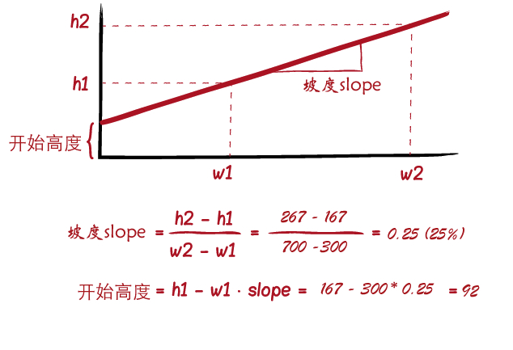

我们面对的设备种类繁多。言外之意，这样的环境之下，Web的页面布局时常会碰到一些缩放比例的控制，特别是针对 img 、 iframe 、 object 、 video 和 embed 等元素的比例缩放。

纵横比分为 **固定纵横比** 和 **自适应纵横比** 。

基于 width 的百分比来设置 padding 百分比值，把这种方式称之为固定纵横比。
```
padding-top = (元素高度 / 元素宽度) * 100%
padding-bottom =  (元素高度 / 元素宽度) * 100%
```

9 / 16 的固定纵横比例，计算出来就是 56.25% 。在sass里面：
```
@mixin fixed-aspect-rations($height, $width) {
    padding-bottom: $height / $width * 100%;
    // 或者
    padding-top: $height / $width * 100%;
}

// function 
@function aspect-ratio($height, $width) {
    $aspect-ratio: $height / $width * 100%;
    @return $aspect-ratio;
}
```

假设我们在宽屏的PC上显示大的图片，而在移动设备上，我们不想使用相同的纵横比例让图像等元素变得太小。当然我们也不想使用完全相同的高度让图像变得太高。希望看到的效果是当宽度变小时，其高度也变得更小。我们就把这种方案称为流体纵横比例。

这种方案可以给元素设置一个高度，来减少 padding-top 或者 padding-bottom 的百分比值。



```
@mixin fluid-ratio($large-size,$small-size) {
    $width-large: nth($large-size,1); //背景图片大尺寸的宽度
    $width-small: nth($small-size,1); //背景图片小尺寸的宽度
    $height-large: nth($large-size,2); //背景图片大尺寸的高度
    $height-small: nth($small-size,2); //背景图片小尺寸的高度
    //计算slope => slope = (h2 - h1) / (w2 - w1)
    //h1:背景图片大尺寸的高度　=> $height-large
    //w1:背景图片大尺寸的宽度  => $width-large
    //h2:背景图片小尺寸的高度　=> $height-small
    //w2:背景图片小尺寸的宽度　=> $width-small
    $slope: ($height-large - $height-small) / ($width-large - $width-small);
    //计算元素的初始高度start Height => Start height = h1 - w1 * slope
    $start-height: $height-small - $width-small * $slope;
    padding-top: $slope * 100%; //你也可以将padding-top换成padding-bottom
    height: $start-height;
}
```

## **新方案**

使用到了 CSS Grid 还使用了CSS的 Viewport单位 以及 CSS的自定义属性 。

采取的方法是创建一个网格容器的列数和宽高比的。给每个列的宽度采用 vw 单位，并且其宽度是纵横比例。这样做的好处是可以调整窗口的宽度来控制容器的大小，同时还能根据纵横比例来进行调整。同时要控制网格行的大小，其大小根据列的计算来设置，控制每个单元格的比例是 1:1 。这里采用 grid-auto-rows 来控制网格行。

```
.container {
    display: grid;
    grid-template-columns: repeat(16, 5.625vw);
    grid-auto-rows: 5.625vw;
}

.embed {
    grid-column: span 16;
    grid-row: span 9;
    width: 100%;
    height: 100%;
}
```

过 span 和 grid-column 和 grid-row 进行网格合并，这里有一个重点： grid-column 合并的横向比例，示例中是 span 16 ； grid-row 合并的是纵向比例，示例中是 span 9 。 同时把嵌入的元素，比如 img 、 iframe 、 video 这些元素的 width 和 height 都设置为 100% ，用来足以填补整个网格区域。


